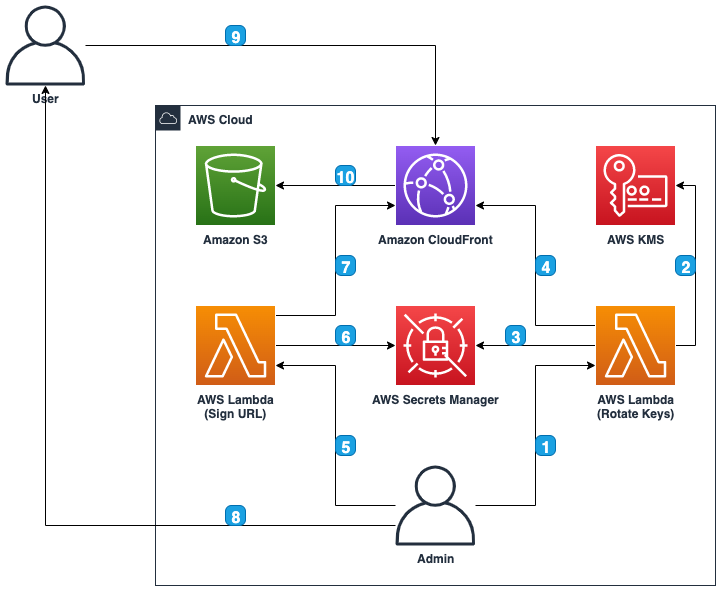

# AWS CDK For Discourse

This sample demonstrates how to create [Amazon CloudFront](https://aws.amazon.com/cloudfront/) signed urls using [CloudFront Key Groups](https://docs.aws.amazon.com/AWSCloudFormation/latest/UserGuide/aws-resource-cloudfront-keygroup.html) and [CloudFront Public Keys]((https://docs.aws.amazon.com/AWSCloudFormation/latest/UserGuide/aws-resource-cloudfront-publickey.html)).

## Architecture

1. The admin user will invoke the rotate keys [AWS Lambda](https://aws.amazon.com/lambda/) when required.
2. The rotate keys AWS Lambda will use the current symmetric key from [AWS Key Management Service](https://aws.amazon.com/kms/) to call generateDataKeyPair which will be converted to PEM format
3. The generated private key PEM is stored in [AWS Secrets Manager](https://aws.amazon.com/secrets-manager/) to be used later when signing URLs
4. The generated public key PEM is stored as a CloudFront Public key. The CloudFront Key Group is also updated with the new Public key.
5. The admin user will invoke the sign url AWS Lambda to generate a [CloudFront signed url](https://docs.aws.amazon.com/AmazonCloudFront/latest/DeveloperGuide/private-content-signed-urls.html) for each file required by the end user.
6. The sign url AWS Lambda will request the current private key PEM file from AWS Secrets Manager
7. The sign url AWS Lambda will get the current public key from the associated Amazon CloudFront distributions key group and sign the url
8. The admin user will send the signed url to the user
9. The user will access the signed url through Amazon CloudFront
10. Amazon CloudFront validates the signed url and access the Amazon S3 bucket returning the results to the user

## Requirements
1. <a href="https://aws.amazon.com/cdk/">AWS Cloud Development Kit</a> (CDK) 2.53.0 or higher
2. [AWS CLI](https://aws.amazon.com/cli/) for testing commands

## Setup
1. Git clone this repository
2. From the <b>root</b> folder for this project run `npm ci` to install all packages required
3. From the <b>root</b> folder for this project run `cdk deploy` to deploy

## Running
1. Once deployed two outputs (RotateKeysLambdaInvokeCommand and SignUrlLambdaInvokeCommand) are created which are the cli commands to rotate the keys and to sign a url 
2. The deployment will perform the initial key rotation by invoking RotateKeysLambdaInvokeCommand
3. To test the creation of a signed url please copy the SignUrlLambdaInvokeCommand cli command into your console and run. This command will produce an output with a signed url. Copy the signed url into your browser of choice to view the 'Hello World' example page via a signed url. 
4. The second output RotateKeysLambdaInvokeCommand can run via your console to invoke the key rotation lambda.

## Useful commands

* `npm run build`   compile typescript to js
* `npm run watch`   watch for changes and compile
* `npm run test`    perform the jest unit tests
* `cdk deploy`      deploy this stack to your default AWS account/region
* `cdk diff`        compare deployed stack with current state
* `cdk synth`       emits the synthesized CloudFormation template

## Resource Cleanup
1. From the <b>root</b> folder for this project run <b>`cdk destroy`</b>

## Security

See [CONTRIBUTING](CONTRIBUTING.md#security-issue-notifications) for more information.

## License

This library is licensed under the MIT-0 License. See the LICENSE file.

